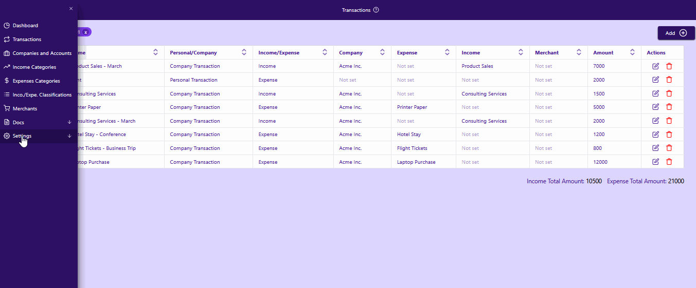
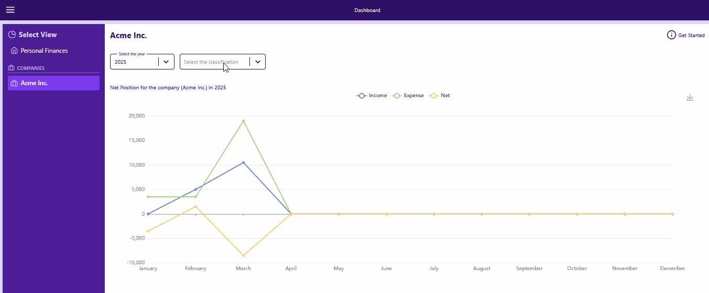

# Personal Finance Manager

A personal finance management application built with Remix and React. Users can track income and expenses, organize transactions, and monitor their financial activity through a simple and intuitive interface.





## Tech Stack 💻

### Core

- **Remix** – Full-stack React framework
- **React** – Frontend library
- **TypeScript** – Typed JavaScript
- **MongoDB** – NoSQL database
- **Docker** – Containerized environment
- **Tailwind CSS** – Utility-first CSS framework
- **Swagger** – API documentation
- **GraphQL** – Query language for APIs
- **Prisma** – A modern ORM providing type-safe database access and streamlined migrations

### Additional Libraries

- **Zustand** – State management
- **DataLoader** – Batch and cache DB requests
- **react-feather** – Icon set
- **react-responsive-modal** – Modal component

## Development 🛠

To start the app in development mode (outside of Docker), run:

```bash
npm run dev
```

This command launches the application and automatically rebuilds assets when files change.

## Docker Deployment 🚀

Follow these steps to set up and run the application using Docker Compose:

1. **Clone the Repository:**

   ```bash
   git clone git@github.com:jhonatanAlanFerreira/financial_manager_remix.git
   cd financial_manager_remix
   ```

2. **Set Up Environment Variables:**

   Copy the example environment file and modify it as needed (for example, to change port settings):

   ```bash
   cp .env.example .env
   ```

3. **Start the Containers:**

   Run the following command to start all containers in detached mode:

   ```bash
   docker-compose up -d
   ```

4. **Check the Front-End Build Logs:**

   To confirm that the front-end has built successfully, check the logs for the `financial_manager_app` container:

   ```bash
   docker-compose logs financial_manager_app
   ```

   You should see log messages similar to:

   ```
   [info] building...
   [info] built (34.1s)
   [remix-serve] http://localhost:3000
   ```

   Wait until you see the “built” message along with the URL before accessing the app in your browser.

> **Note:** If you're new to Docker or Docker Compose, please refer to the [Docker Documentation](https://docs.docker.com) for more details on how Docker works and how to troubleshoot common issues.

## Additional Endpoints

Once the Docker containers are running (assuming default port `3000`):

- **Swagger UI**: Visit [http://localhost:3000/docs](http://localhost:3000/docs) for API documentation.
- **GraphQL Playground**: Access [http://localhost:3000/graphql-playground](http://localhost:3000/graphql-playground) to explore and test your GraphQL queries.

## Prisma Commands 🗄

Since the application is running inside Docker containers, run these commands within the `financial_manager_app` container:

- **Seed Database:**

  ```bash
  docker-compose exec financial_manager_app npx prisma db seed
  ```

- **Sync Database Schema:**

  ```bash
  docker-compose exec financial_manager_app npx prisma db push
  ```

- **Generate Prisma Client:**

  ```bash
  docker-compose exec financial_manager_app npx prisma generate
  ```

## Testing 🧪

To run tests or type checking within the Docker container:

- **Type Checking:**

  ```bash
  docker-compose exec financial_manager_app npm run typecheck
  ```

- **Unit and Feature Testing:**

  ```bash
  docker-compose exec financial_manager_app npm run test
  ```

---

For more in-depth notes on architecture decisions, state management, and other considerations, see the [Project Notes](./LEARNINGS.md).
